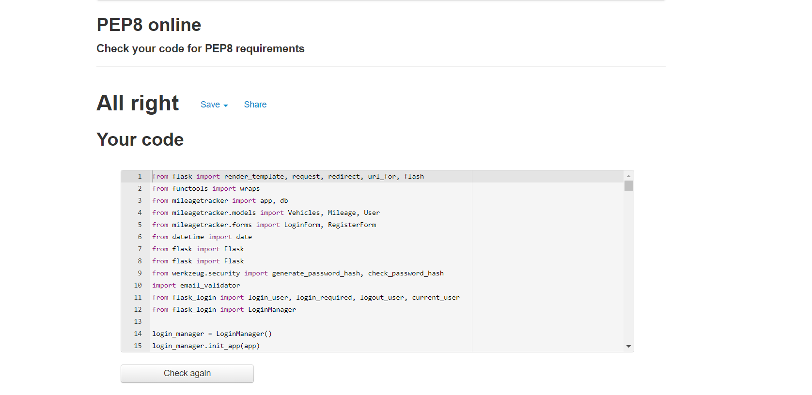
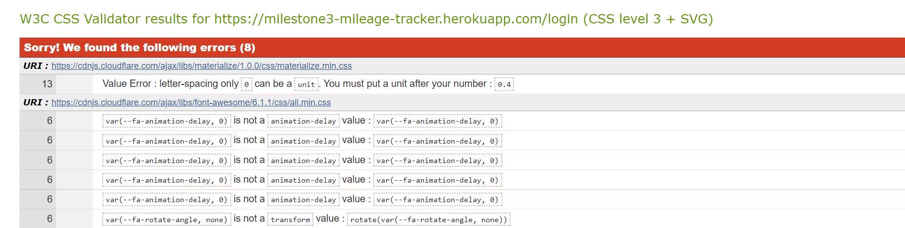
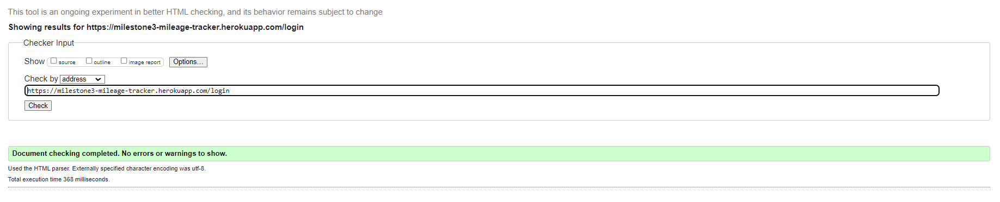

# User Stories

- As a user, I want to be able to record the trips I am taking in a given Vehicle
- As a user, I want to be able to edit any of the previous trips I have taken incase of a typo
- As a user, I want the structure of the site to be intuitive and easy to navigate
- As a user, I want to be able to delete a Vehicle when it is no longer in the companies possession
- As a user, I want to be able to access the site on all devices, though this is primarily a mobile app
- As a user, I want access to be restricted for certain actions to Administrators, such as creating new accounts, deleting vehicles and deleting more than the previous mileage record

The website's main purpose is to record the mileage covered whilst driving a work provided vehicle. In order to do this, it must be intuitive to use. I achieved this by keeping a simple, clean design throughout. In order to meet it's main purpose, the website has to enable user's to create, edit, update and delete individual mileage records. This is achieved using a postgres database. In order to stop staff taking advantage, certain restrictions have the imposed as to who can perform what function. Only administrators are able to delete, edit or create new vehicles to record mileage for. 
### First Time Visitor Goals

- A simple and responsive navigation throughout the site
- To be able to register to a mileage record
- To be able to login to the app
- To be able to log out of the app

- The app's design and layout is intuitive and is also signposted with labels and button text.
- users are able to register a mileage record
- Users are able to create and login with accounts

### Returning Visitor Goals

- To be able to view past trips

### Developer Goals

- To create a database with POSTGRESQL  
- To implement CRUD functionality using flask-sqlalchemy
- To create a responsive, clean and consistent UX
- To not allow users to edit/delete other users mileage records#
- To ensure there is a level of permissions so standard user's cant delete Vehicles and multiple mileage records

- Full CRUD functionality is implemented via the vehicles and mileage table in a postgresql database

# Code Validation

## Pep8
- my code now complies with the python pep8 standard, after removing incorrect white spaces

## W3C CSS
- I didn't write any custom CSS for this project, the only errors come from font awesome and materialize's css files

## W3C HTML
- my code passes W3C's html validator

# Functionality Testing
1. Login Screen
    - If you are not logged in, the navbar will only show 'Log in' and 'Sign up'
2. Home page 
    - If you are a new user, or not logged in, you will be redirected to the login page
    - If you click on a Vehicle registration, you are redirected to the "View Vehicle Details Page"
3. View Vehicle Details Page
    - If you click on a record, it expands and shows further details.
    - if you click edit on a record, it redirects you to the edit mileage record page.
    - If you click delete on a record, it deletes the record
    - If you click new record, it takes redirects you to the new record page
    - The page displays all existing mileage records for that vehicle
4. Edit Mileage Page
    - If you leave any item blank, the form will not submit
    - If you change a value and submit it, the value changes
    - When you submit, you are redirected to the "View Vehicle Details Page"
5. New Mileage Page
    - If you leave any item blank, the form will not submit
    - The current mileage and previous location, in the previous record, are auto filled into the new one
    - The time automatically fills when you select the box
    - When you submit, you are redirected to the "View Vehicle Details Page"
6. Admin Console
    - Only users with the Admin role can access this and subsequent pages
    - when you select Add vehicle registration, you are redirected to the add vehicle page
    - when you select Edit vehicle, you are redirected to the edit vehicle page
    - when you select create new user, you are redirected to the sign up page, where you can create a new user
7. Add vehicle registration
    - when you click 'add registration', it is added to the database
    - you cannot submit an empty form
    - when you submit, you are redirected to the home page
8. Edit vehicle 
    - you can change the registration of an existing vehicle
    - when you submit, you are redirected to the admin console
9. Sign up 
    - As a new user, you can create an account that will only have 'user' level access
    - As an admin, you can create an account that will have user or admin level access
    - The form will not submit if empty
    - The form has a password validation field that wont submit the form if the passwords don't match
    - after submission, you are redirected to the login page
10. Navbar
    - Only an admin is able to see the admin console link, clicking it redirects you to the admin console page
    - any user can use the logout link to logout, clicking this then redirects you to the login page
    - any user can use the select vehicle link to get to the home page

# Bugs
- The main bug surrounded not being able to register a new user. This occurred after I added the validation logic passwords. Originally, this form was implemented using WTForms, but I rewrote it in standard HTML and it now works as intended. The only WTForms page left is the login page, as this is the only one that works as intended
# Deployment
- Heroku's postgres add-on doesn't provide the correct connection string, that was resoled by adding it into the string programatically in my __init__.py file
